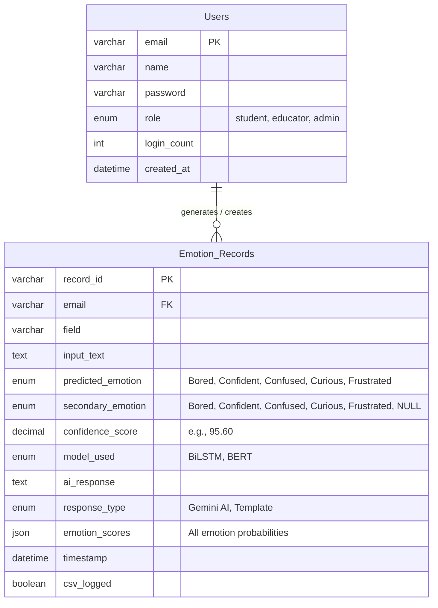

# Socratica | Emotion-Aware Learning Companion

Socratica is a lightweight, custom-built web application designed to support learners by detecting their emotional state as they work through study roadblocks. By analyzing a free-text problem statement, Socratica compares a pre-trained RoBERTa model side-by-side with a custom-trained BiLSTM model to identify target emotions, and uses the Gemini API (with seamless fallback templates) to provide highly empathetic, subject-aware learning strategies.

This project was built to address all PRD constraints, avoiding default Streamlit looks or template designs, and utilizing a custom HSL-based modern edtech design system.

---

## Team & Owner Attribution

- **Aaditya Mishra (Lead)**: Model inference wrappers (pretrained RoBERTa & custom BiLSTM), unified prediction schema, and mixed-emotion classification logic.
- **Dhruv Sain**: Backend API routing (`/predict`, `/history`, `/log`), CSV log formatting and writing, Gemini API integration, and response regeneration logic.
- **Zenul Aabedeen Khan**: Frontend HTML/CSS/JS architecture, customized progress bars, responsive layout, and Chart.js analytics dashboards.
- **Palak Agarwal**: Environment setup (`requirements.txt`), template configurations (`.env`), and startup automation scripting.
- **Priya Sharma**: Documentation, setup guide, and final walkthrough write-up.

---

## Tech Stack & Architecture

- **Backend**: Python (FastAPI + Uvicorn) for REST endpoints.
- **Frontend**: Vanilla HTML5 / CSS3 / JavaScript (Modern custom theme) using Google Fonts ('Outfit' display pairing with 'Plus Jakarta Sans' body text).
- **Machine Learning**: 
  - **Model A (RoBERTa)**: Inference-only pipeline using `SamLowe/roberta-base-go_emotions` (500MB) from Hugging Face Hub, mapped onto the 5 target emotions.
  - **Model B (BiLSTM)**: Small PyTorch BiLSTM (Embedding dim=64, Hidden dim=64, Mean Pooling) trained from scratch on a clean, single-label mapped subset of 1,250 examples of GoEmotions.
- **AI Integration**: Google GenAI / Gemini API for contextual feedback.
- **Visualizations & Assets**: Chart.js (CDN) for overall emotion distribution history (Polar Area Chart).

---

## Prerequisites
- Python 3.12+ (Tested on Python 3.14)
- Pip package manager

---

## Project Flow
 
1. User selects a study subject and describes their problem in free text.
2. On clicking "Analyze & Get Support", the input is sent to the backend `/predict` endpoint.
3. Two models independently classify the emotion: a pre-trained RoBERTa model and a
   custom-trained lightweight BiLSTM — both return the same structured prediction format
   (primary emotion, confidence, all emotion scores, mixed/secondary emotions ≥15%).
4. Results from both models are displayed side by side for comparison.
5. If the "Use AI Assistant" toggle is on, the detected emotion + subject + problem text
   are sent to the Gemini API to generate an empathetic, field-specific response;
   otherwise a template-based fallback response is shown.
6. Every interaction (inputs, both models' predictions, selected response) is logged
   to a session file for later analysis.
7. The Analytics tab visualizes emotion trends across all logged sessions using charts.
---


## Setup & Running Instructions

### 1. Clone & Set Up the Environment
Open a terminal in the project folder and run the following:

```bash
# 1. Install dependencies
pip install -r requirements.txt

# 2. Add your Gemini API Key in the template .env file
# Open the .env file in a text editor and update:
# GEMINI_API_KEY=your_actual_gemini_api_key
```

### 2. Run the Application
Start the FastAPI server:

```bash
python main.py
```

*Note: On startup, the backend automatically checks if the custom BiLSTM model (`bilstm_model.pth` and `vocab.json`) exists. If not found, it programmatically downloads a subset of GoEmotions, trains the BiLSTM model on CPU (takes ~5-15 seconds), saves the files, and launches the server.*

### 3. Open the Client
Once Uvicorn is running, open your web browser and navigate to:
```
http://localhost:8000
```

---

## Emotion Classification Mapping Rules

The GoEmotions source labels are mapped to Socratica's 5 target emotions as follows:
- **Bored**: `neutral`, `disappointment`, `sadness`
- **Confident**: `approval`, `pride`, `admiration`, `optimism`
- **Confused**: `confusion`
- **Curious**: `curiosity`
- **Frustrated**: `annoyance`, `anger`, `disapproval`

*Mixed Emotion Detection*: Any target emotion (other than the primary top-scoring emotion) with a confidence score greater than or equal to **15%** is categorized as a secondary emotion.

## Epic 5. Streamlit UI Implementation
 
The frontend is built with plain HTML/CSS/JS (no framework), organized into three
main views accessible from the top navigation bar: **Workspace**, **Analytics**, and
**Session Log**.
 
**Workspace view — layout and sections:**
- *Input panel (left)*: Study subject dropdown, free-text problem textarea, "Use AI
  Assistant" toggle, model selector (RoBERTa / BiLSTM) for which model's emotion drives
  the response, and the "Analyze & Get Support" submit button.
- *Response panel (top right)*: Displays the generated learning support response, with
  a manual "Regenerate" icon button to re-run generation without re-submitting the form.
- *Model comparison panel (bottom right)*: Two cards, one per model, each showing the
  primary emotion (with icon + confidence %), secondary/mixed emotions (≥15%
  confidence), and a confidence breakdown bar chart for all 5 emotions.
**Design system:**
- Each of the 5 emotions has one fixed color used consistently across badges, chart
  bars, and card accents (not a decorative gradient) — this makes the same emotion
  instantly recognizable everywhere in the UI.
- Form controls show clear loading states (spinner on the submit button) while
  waiting on the `/predict` and Gemini response calls, and inline error messages if
  a call fails (e.g. missing/invalid Gemini API key) instead of failing silently.
**Session state handling:**
- The last submitted input, both models' results, and the current response are kept
  in front-end state so switching between Workspace/Analytics/Session Log tabs does
  not lose the current result.
- Toggling "Use AI Assistant" or changing the input triggers a regeneration request
  without re-running the emotion classification twice unnecessarily — classification
  results are cached client-side until the input text actually changes.
**Analytics view:**
- Built with Chart.js, reading from the session log (CSV/SQLite) via a `/sessions`
  endpoint.
- Shows an emotion-distribution chart (count of each primary emotion detected across
  all past sessions) so trends over time are visible at a glance.
**Responsiveness & accessibility:**
- Layout collapses to a single column below ~768px width.
- All interactive elements have visible keyboard focus states.
- Emotions are distinguished by icon + label in addition to color, not color alone.
---

## Entity Relationship (ER) Diagram

The following diagram illustrates the relationship between users and their emotion records, providing a robust design for user-scoped session logging and support:



### Entities Description

#### 1. **Users**
*   `email` (PK, `VARCHAR(255)`): Unique identifier for each user.
*   `name` (`VARCHAR(100)`): Display name of the user.
*   `password` (`VARCHAR(255)`): Hashed credentials.
*   `role` (`ENUM`): User role restriction (`student`, `educator`, `admin`).
*   `login_count` (`INT`): Track user interaction and active frequency.
*   `created_at` (`DATETIME`): Session account creation timestamp.

#### 2. **Emotion_Records**
*   `record_id` (PK, `VARCHAR(36)`): Unique identifier for each logged analysis session.
*   `email` (FK, `VARCHAR(255)`): References `Users.email` to map each session back to the student.
*   `field` (`VARCHAR(100)`): Selected study subject.
*   `input_text` (`TEXT`): Student's description of their problem.
*   `predicted_emotion` (`ENUM`): Primary classified emotion (`Bored`, `Confident`, `Confused`, `Curious`, `Frustrated`).
*   `secondary_emotion` (`ENUM`): Secondary classified emotion (`Bored`, `Confident`, `Confused`, `Curious`, `Frustrated`, or `NULL`).
*   `confidence_score` (`DECIMAL(5,2)`): Classification confidence percentage (e.g., 95.60).
*   `model_used` (`ENUM`): Model driving the response (`BiLSTM`, `BERT`).
*   `ai_response` (`TEXT`): Empathetic support response text.
*   `response_type` (`ENUM`): Generation mode (`Gemini AI`, `Template`).
*   `emotion_scores` (`JSON`): Complete distribution probability mapping of all 5 target emotions.
*   `timestamp` (`DATETIME`): Date and time of the logging event.
*   `csv_logged` (`BOOLEAN`): Sync verification flag.

### Key Details & Use Cases
*   **1-to-Many Relationship**: One User can generate many Emotion Records, but each Emotion Record belongs to exactly one User (`Users (1) ───< Emotion_Records (N)`).
*   **Supported Use Cases**: User registration/auth, side-by-side classification predictions, mixed-emotion analyses, response generation logging, CSV/database exporting, and session history queries.
*   **Scalability & Cloud Fit**: Easily maps to relational databases (PostgreSQL, MySQL) or document stores (MongoDB, Firestore), allowing user-based historical analysis and analytics.

---

## Unified Prediction Schema & Backend Integration (Epics 3 & 4)

**Prediction schema** — both models (`RoBERTa` and `BiLSTM`) return this exact
structure from the emotion detection module, so the rest of the app (API, UI,
logging) never needs to know which model produced a result:

```json
{
  "primary_emotion": "Confused",
  "primary_confidence": 0.62,
  "all_emotions": {"Bored": 0.02, "Confident": 0.05, "Confused": 0.62, "Curious": 0.18, "Frustrated": 0.13},
  "mixed_emotions": [["Curious", 0.18]]
}
```
A "mixed emotion" is any entry in `all_emotions` other than the primary one whose
confidence is ≥ 0.15.

**Backend API:**
- `POST /predict` — accepts `{field, problem_text}`, runs both models, returns both
  prediction objects (schema above) without generating a Gemini response yet, so the
  UI can render the comparison immediately.
- `POST /generate` — accepts `{field, problem_text, emotion_result, use_ai}`. If
  `use_ai` is true, builds a prompt from the field, problem text, and the selected
  model's detected emotion/confidence, and calls the Gemini API. If the call fails or
  `use_ai` is false, falls back to a template response selected by primary emotion
  (see fallback templates in `utils/gemini_utils.py`).
- `POST /log` — appends the full session (inputs, both predictions, selected model,
  final response, timestamp) to the session store (CSV/SQLite).
- `GET /sessions` — returns logged sessions for the Analytics view.

**Regeneration logic:** Changing the input text or toggling "Use AI Assistant"
triggers a fresh call to `/generate` only (not `/predict` again, unless the problem
text itself changed) — this keeps displayed emotion scores in sync with whichever
response is currently shown, while avoiding redundant model inference calls.

**Fallback templates:** Each of the 5 emotions maps to a short, non-AI-generated
supportive message template (e.g. Confused → "It's okay to feel stuck — try
breaking the problem into smaller steps and revisiting the basics of [field]."),
used whenever Gemini is unavailable, so the app never leaves the user with no
response.

---

## End-to-End Validation & Deployment Readiness (Epic 6)

**Manual validation checklist (run before submission):**
- [ ] Submitting a problem returns both model predictions within a few seconds
- [ ] Mixed emotions display correctly when a secondary emotion is ≥15%
- [ ] Toggling "Use AI Assistant" off shows a template response, not an error
- [ ] Toggling it back on and clicking Regenerate produces a fresh Gemini response
- [ ] Switching the "model selector" changes which model's emotion drives the response
- [ ] Session Log tab shows the just-submitted session
- [ ] Analytics tab chart updates after new sessions are logged
- [ ] Missing/invalid Gemini API key shows a clear inline error, not a crash

**Deployment readiness notes:**
- `.env` must never be committed — confirm `.gitignore` includes it.
- `requirements.txt` should be pinned to versions actually used, to avoid
  environment mismatches when teammates or the mentor run it locally.
- If deploying (e.g. Render/Railway) instead of just running locally for the demo,
  set `GEMINI_API_KEY` as an environment variable in the hosting platform's
  dashboard rather than uploading `.env`.

